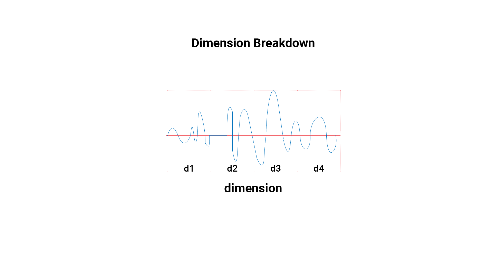

# analyze_track

Java used to analyze music sound waves within genres using processing for painting.

## Question

Is there any similarities between sound waves within genres of music?

## Background

On Spotify, Katy Perry's (pop singer) songs were within the Avenged Sevenfold (Rock/Metal) station. The station's composition was incredibly perplexing, and wondered if this is a mistake by Spotify's categorization algorithm, or could this be how a machine understands genres?

We categorize music based on how similar it sounds to other existing music. We rarely find a big metal breakdown in pop music, and when we do, it is surprising. We can alphabetize songs by their author(s), but could there exist another method of categorization, a categorization only a computer or machine would understand?

We as humans only understand certain sounds, based on numerous factors and components, from the physical space we are in, to how much water is in the air around us which would dampen the vibrations made by a given object. A machine can read the script from a sound file and the relay this information that we would otherwise miss. Wondering if a machine reading various sound files would categorize music differently than would, mixing Avenged Sevenfold with Katy Perry to a machine might make sense in ways that are foreign to us. A machine unless specified or programmed to delineate between rock and pop music might look at the musical portfolio on Spotify differently.

## Objective

Review 5 songs from each genre, then cross-compare their sound waves and see if there exist any verbose similarities between them. Focusing on the amplitude or height of each wavelength of sound and the distribution of amplitudes across a given song. The genre categorizations are derived from Spotify.

### Songs By Genre

* Country
    * Here you Come Again - Dolly Parton
    * Y'all Boys - Florida Georgia Line
    * Kentucky Waltz - Bill Monroe
    * Seven Spanish Angels - Willie Nelson and Ray Charles
    * I Walk the Line - Johnny Cash
* EDM
    * Hi Friend - Deadouse - DONE
    * Kids - MGMT
    * Jar of Hearts - Twenty One Pilots - DONE
    * reccess - Skrillex
* Hip-Hop
    * Big Poppa - Notorious B.I.G
    * Wu Tang Aint Nuthing to F'Wit - Wu Tang Clan
    * Feel Good - Gorrillaz
    * Hey Ya - Oukast
    * Neon Cathedral - Macklemore & Ryan Lous
* Indie
    * Little Lion Man - Mumford and Sons
    * Home - Edward Sharpe and the Magnetic Zereos
    * Grand Budapest Hotel - Georze Erza
    * Cameras - Matt and Kim
    * Twin Size Mattress - Front Bottoms
* Metal
    * Almost Easy - Avenged Sevenfold
    * Tears Don't Fall - Bullet for my Valentine
    * Chop Suey - System of the Down
    * Wrong Side of Heaven - Five Finger Death Punch
    * Enter Sandman - Metalica
    * Paranoia - A Day To Remember
* Pop
    * Teenage Dream - Katy Perry
    * Locked out of Heaven - Bruno Mars
    * Only One - Sam Smith
    * Blank Space - Taylor Swift
    * All Star - Smash Mouth
    * I Gotta Feeling - Black Eyed Peas
* Reggae
    * Count Me In - Pepper
    * Santeria - Sublime
    * Lay me Down - Dirty Heads
    * House - Jimmy Cliff
* Rap
    * Sloppy Seconds - Watsky
    * Lace Up - Machine Gun Kelly
    * Till I Collpase - Eminem
    * Best Friend - Yelowolf
    * Breath of Air - Grieves
* Rock
    * Even Flow - Pearl Jam
    * Sail - Awolnation
    * Crazy Train - Ozzy
    * Cult of Personality - Living Colour
    * Boogie - ZZ Top
* Soul
    * Africa - Toto
    * Saturday - Chicago
    * September - Earth Wind and Fire
    * What is Hip? - Tower of Power
    * Superstition - Stevie Wonder

| genre | song name | song artist | song duration | meta data | index/value csv created? |
|--------|--------------------------------|-------------------|---------------|-----------|--------------------------|
| Edm | Hi Friend | deadmouse |  |  | TRUE |
| Edm | jar of hearts | twenty one pilots |  |  | TRUE |
| Edm | kids | MGMT |  |  | TRUE |
| Edm | recess | Skrllex |  |  | TRUE |
| Hiphop | big poppa | Notrious B.I.G |  |  | TRUE |
| Hiphop | hey ya | Outkast |  |  | TRUE |
| Hiphop | feel good | Gorrillaz |  |  | TRUE |
| Hiphop | wu tang ain't nothing to f'wit | Wu Tang Clan |  |  | TRUE |
| Hiphop | neon cathedral | Macklemore |  |  | TRUE |
| Indie | cameras | Matt and Kim |  |  | TRUE |
| Indie | home | Edward Sharpe and Magnetic Zeroes |  |  | TRUE |
| Indie | Budapest Hotel | George Ezra |  |  | TRUE |
| Indie | Little Lion Man | Mumford and Sons |  |  | TRUE |
| Indie | Twin Size Mattress | The Front Bottoms |  |  | TRUE |
| Metal | almost easy | Avenged Sevenfold |  |  | TRUE |
| Metal | chop Suey | System of the Down |  |  | TRUE |
| Metal | Enter Sandman | Metallica |  |  | TRUE |
| Metal | Paranoia | A Day to Remember |  |  | TRUE |
| Metal | Tears Don't Fall | Bullet for My Valentine |  |  | TRUE |
| Pop | All Star | Smash Mouth |  |  | TRUE |
| Pop | Blank Space | Taylor Swift |  |  | TRUE |
| Pop | I Gotta Feeling | Black Eyed Peas |  |  | TRUE |
| Pop | Locked Out of Heaven | Bruno Mars |  |  | TRUE |
| Pop | Teenage Dream | Katy Perry |  |  | TRUE |
| Reggae | Count Me In | Pepper |  |  | TRUE |
| Reggae | house |  |  |  | TRUE |
| Reggae | Lay Me Down | Dirty Heads |  |  | TRUE |
| Reggae | Santeria | Sublime |  |  | TRUE |
| Reggae |  |  |  |  |  |
| Rap | Breath of Air | Grieves |  |  | TRUE |
| Rap | Best Friend | Yelawolf |  |  | TRUE |
| Rap | Till I Collapse | Eminem |  |  | TRUE |
| Rap | Sloopy Seconds | Watsky |  |  | TRUE |
| Rap | Lace Up | MGK |  |  | TRUE |
| Rock | Boogie | ZZ Top |  |  | TRUE |
| Rock | Cult of Personality | Yelawolf |  |  | TRUE |
| Rock | Even Flow | Pearl Jam |  |  | TRUE |
| Rock | Make Sure | Taking Back Sunday |  |  |  |
| Rock | Sail | Imagine Dragons |  |  | TRUE |
| Soul | Africa | Toto |  |  | TRUE |
| Soul | Saturday | Chicago |  |  | TRUE |
| Soul | September | Earth Wind & Fire |  |  | TRUE |
| Soul | Superstition | Stevie Wonder |  |  | TRUE |
| Soul | What is Hip | Tower of Power |  |  | TRUE |

### Inputs

Input data file in ```.mp3``` format

### Output

dump file of sound analysis in an array of objects.

#### Variables

| key | value | range | notes |
|------------------|--------|------| ------ |
| height | float | 0 - 10 | height of the band above 0. Each sound wavelength's amplitude is measured and normalized to floats between 0 -10 |
| i | index/band number | 0 - 512 | 512 java processing script requires a power of 2 for rendering, 512 provides adequete resolution while being relatively computational light |
| d | distribution of bands |  d > 0 | dimension is inclusive |
| d1 | distribution zone 1 | 0 - 127 | 0 <= d1 < d2 |
| d2 | distribution zone 2 | 128 - 256 | d1 < d2 < d3 |
| d3 | distribution zone 3 | 257 - 383 | d2 < d3 < d4 |
| d4 | distribution zone 4 | 384 - 512 | d3 < d4 <= 512 |

<!-- #### Wavelength -->


<!-- ### Dimension -->



#### output object

| key | value |
|------------------|--------|
| avgHeight | float |
| upperHeightLimit | float |
| lowerHeightLimit | float |
| distribution | object |
| d1 | float |
| d2 | float |
| d3 | float |
| d4 | float |

### Technical Libraries

* [Processing](https://processing.org/)

* [SoundFile](https://processing.org/reference/libraries/sound/FFT.html)

* [ReadCSV] (https://www.mkyong.com/java/how-to-read-and-parse-csv-file-in-java/)

* [Analyze Area] (https://stackoverflow.com/questions/25439243/find-the-area-between-two-curves-plotted-in-matplotlib-fill-between-area)
### Readings

Goldhagen, Sarah Williams. Welcome to Your World: How the Built Environment Shapes Our Lives. Harper, an Imprint of HarperCollinsPublishers, 2017.

Zumthor, Peter. Peter Zumthor: Atmospheres: Architectural Environments, Surrounding Objects. Birkhäuser, 2006.
